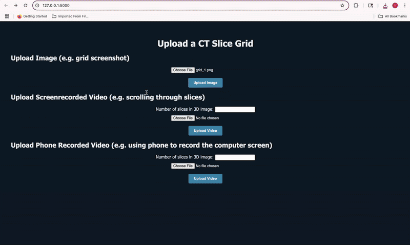

# 3D-Reconstruction-App-for-CT-and-MRI-Image-Slices
Use this web app to upload a picture of 2D frame slices or a video where you scroll through the slices of a 3D volume and receive a 3D nifti volume.

This web app harnesses YOLOv8 and custom-trained models to intelligently detect, extract, and realign CT/MRI slices from various input formats — producing a clean 3D NIfTI file reconstruction. The user can upload inputs via the following scenarios:

1) **Upload a 2D Grid of Slices (Image)**
   
Upload a single image containing a grid of CT/MRI slices, ordered left to right, top to bottom.


2) **Upload a Screen Recording (Video)**
Upload a screenrecorded video (e.g., from 3D Slicer) where you scroll through axial slices using a slider or keyboard. The app detects frames where the slice changes and reconstructs a volume.


3) **Upload a Phone Recording (Video)**
Upload a phone-recorded video of a monitor while scrolling through slices. The model detects CT slices frame-by-frame and builds the 3D volume.


## Install and Usage Instructions

```bash
# pip install
pip install git+https://github.com/vikramgoddla/3D-Reconstruction-App-for-CT-and-MRI-Image-Slices

# more manually (first clone then)
# Clone the repository
git clone https://github.com/vikramgoddla/3D-Reconstruction-App-for-CT-and-MRI-Image-Slices.git
cd 3D-Reconstruction-App-for-CT-and-MRI-Image-Slices

# Install dependencies
pip install -r requirements.txt

## Demo.py usage instructions

demo.py provides an easy usage interface in your workspace terminal. Check below to see command line format for feeding different file types (image, phone video, and screen video) and test aligned vs unaligned.

```bash
# download model weights locally and add to workspace
# Option 1: clone repo 
git clone https://github.com/vikramgoddla/3D-Reconstruction-App-for-CT-and-MRI-Image-Slices.git
cd 3D-Reconstruction-App-for-CT-and-MRI-Image-Slices

# Option 2: download model-weights folder from repo

# Command line formatting:
python demo.py my_video.mov                # Screen video
python demo.py my_video.mov --phone       # Phone video
python demo.py my_video.mov --align       # With alignment
python demo.py my_grid.png                # Grid of slices (image)


